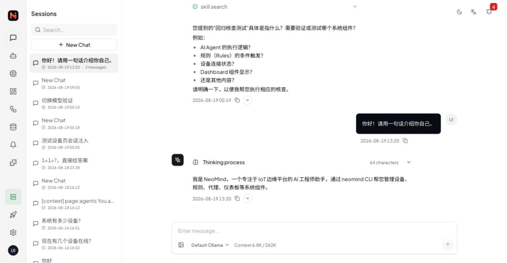
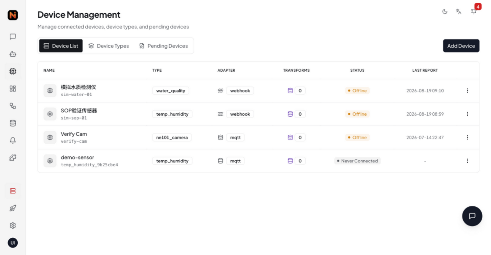
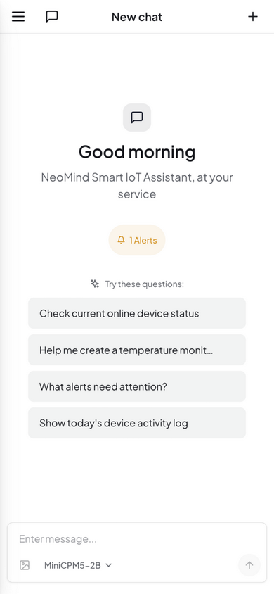

<p align="center">
  
</p>

<h3 align="center">面向物联网自动化的边缘 AI 平台</h3>

<p align="center">
  基于 Rust 的边缘智能 — 连接设备、运行 AI 智能体、自动化一切。
</p>

<p align="center">
  <a href="https://github.com/camthink-ai/NeoMind/actions/workflows/build.yml">
    
  </a>
  
  <a href="https://github.com/camthink-ai/NeoMind/releases/latest">
    
  </a>
  
  
</p>

<br/>

<div align="center">
  
  <br/><sub><b>仪表板</b></sub>
</div>

<br/>

<div align="center">
  <table>
    <tr>
      <td align="center">
        
        <br/><sub><b>AI 对话</b></sub>
      </td>
      <td align="center">
        
        <br/><sub><b>设备管理</b></sub>
      </td>
      <td align="center">
        
        <br/><sub><b>移动端</b></sub>
      </td>
    </tr>
  </table>
</div>

<br/>

## NeoMind 是什么?

NeoMind 是一个**边缘部署的 AI 平台**,为物联网注入智能:LLM 智能体直接运行在你的硬件上,通过 MQTT/BLE/Webhook 接入设备,用规则引擎自动响应,并在实时仪表板上可视化一切——无需依赖云端。

**核心理念**:用自然语言和你的设备对话。AI 理解你的意图、查询设备状态、创建自动化规则、自主执行操作。

> 📚 **完整文档在 [NeoMind Wiki](https://wiki.camthink.ai/docs/neomind/product-overview/what-is-neomind)。** 本 README 只是速览:
>
> - [产品概览](https://wiki.camthink.ai/docs/neomind/product-overview/what-is-neomind) — 产品定位与核心概念
> - [五分钟快速开始](https://wiki.camthink.ai/docs/neomind/quick-start/five-minute-guide) — 快速跑起来
> - [安装与配置](https://wiki.camthink.ai/docs/neomind/user-guide/install-setup) — 桌面端、服务器、Docker
> - [开发者指南](https://wiki.camthink.ai/docs/neomind/developer-guide/overview) — API、扩展、集成

### 为什么选 NeoMind?

- **完全自包含** — 内嵌 MQTT broker 与 redb 存储,无需安装外部数据库或消息中间件
- **端到端类型安全** — Rust 后端的编译期保证;智能体的 CLI 命令进程内派发、结构化数据,没有脆弱的字符串解析
- **扩展崩溃隔离** — 扩展运行在独立进程,基于能力的权限控制;劣化扩展绝不会拖垮服务器
- **云端可选** — 本地 LLM(llama.cpp)100% 离线可用,需要更强算力时随时接入云端模型

## 功能特性

### AI 智能
- **自然语言控制** — 与设备对话,上传图像进行视觉分析
- **自主智能体** — 定时/事件驱动,带记忆与技能的多步工具调用
- **内置 LLM + 任意后端** — 自带本地模型开箱即用;支持 Ollama、llama.cpp 及任意云厂商(OpenAI、Anthropic、Qwen、DeepSeek、GLM、xAI…)

### 设备接入
- **MQTT(内嵌 broker、mTLS)· BLE 配网 · HTTP/Webhook** — 三条接入路径,零外部依赖
- **自动发现 + AI 辅助纳管** — 未知设备自动识别、定型、引导接入
- **自定义设备类型** — JSON 定义指标与命令,无需写代码

### 自动化
- **规则引擎** — 递归 JSON 条件、通知/执行/触发智能体动作、冷却与持续时间去抖
- **JS 数据变换** — 从实时数据流计算虚拟指标
- **事件总线** — 所有组件经发布/订阅解耦

### 仪表板
- **拖拽式搭建** — 数值卡片、图表、仪表、VLM 视觉组件
- **实时更新(WS/SSE)** 与可分享的公开链接
- **自定义组件** — 发布 React 组件到组件市场

### 告警与集成
- **7 个通知渠道** — Webhook、邮件、Telegram、企业微信、钉钉、Slack、飞书
- **数据推送** — 遥测数据转发至外部系统,带重试与去重

### 平台
- **桌面应用**(macOS/Windows/Linux)+ **移动友好 Web**,中英双语
- **进程隔离扩展**(Native + WASM),能力级权限
- **多实例管理、完整 CLI、API Key 接入**

## 生态

| 仓库 | 定位 |
|------|------|
| **[NeoMind](https://github.com/camthink-ai/NeoMind)**(本仓库) | 核心平台 — 后端、前端、桌面应用 |
| **[NeoMind-Extensions](https://github.com/camthink-ai/NeoMind-Extensions)** | 官方扩展市场 — 22 个扩展:视觉(YOLO/人脸/OCR)、语音(TTS/ASR)、IoT 桥接(HA/Modbus/BACnet/ONVIF/OPC-UA/LoRaWAN)等 |
| **[NeoMind-DeviceTypes](https://github.com/camthink-ai/NeoMind-DeviceTypes)** | 设备类型定义 — 物联网硬件的标准指标与命令 |
| **[NeoMind-Dashboard-Components](https://github.com/camthink-ai/NeoMind-Dashboard-Components)** | 仪表板组件市场 — 社区贡献的 React 组件 |

### 支持设备

NE301(边缘 AI 相机)与 NE101(感知相机)。完整设备类型见 [NeoMind-DeviceTypes](https://github.com/camthink-ai/NeoMind-DeviceTypes)。

### 参与生态建设

- **[开发扩展](https://github.com/camthink-ai/NeoMind-Extensions)** — 为新数据源、AI 模型或集成开发扩展,参照[扩展开发指南](https://wiki.camthink.ai/docs/neomind/developer-guide/overview),提交 PR 到市场
- **[添加设备类型](https://github.com/camthink-ai/NeoMind-DeviceTypes)** — 为你的硬件定义指标与命令,一个 JSON 文件即可
- **[制作仪表板组件](https://github.com/camthink-ai/NeoMind-Dashboard-Components)** — 构建可复用的 React 组件(图表、仪表、地图等)分享给社区

## 快速开始

> 完整流程见 wiki 的[五分钟指南](https://wiki.camthink.ai/docs/neomind/quick-start/five-minute-guide)与[安装配置](https://wiki.camthink.ai/docs/neomind/user-guide/install-setup)。

### 桌面应用(推荐)

从 [GitHub Releases](https://github.com/camthink-ai/NeoMind/releases/latest) 下载最新版本。

| 平台 | 格式 |
|------|------|
| macOS(Apple Silicon + Intel)| `.dmg` |
| Windows | `.msi` / `.exe` |
| Linux | `.AppImage` / `.deb` |

首次启动会经过四步引导(欢迎 → LLM 后端 → 设备 → 就绪),创建管理员账户后即可完成全部基础配置。

### 服务器部署

一行安装(Linux & macOS):

```bash
curl -fsSL https://raw.githubusercontent.com/camthink-ai/NeoMind/main/scripts/install.sh | sh
```

浏览器访问 `http://your-server:9375`。

<details>
<summary>更多安装方式</summary>

**Docker(直接拉取 Docker Hub 官方多架构镜像,无需构建):**

```bash
docker run -d --name neomind \
  -p 9375:9375 -p 1883:1883 \
  -v neomind-data:/app/data \
  camthink/neomind:latest
```

完整选项 — Docker Compose、固定版本、自定义目录、nginx 反向代理、手动安装 — 见 wiki 的[安装与配置](https://wiki.camthink.ai/docs/neomind/user-guide/install-setup)。

</details>

### 推荐本地模型

在 **设置 → LLM 后端**(或首次引导)中选择目录内的模型 — 下载即用,零配置。上下文默认取各模型的实测最优值,可按 32K/64K/128K 预设或自定义调高。

成绩来自 2026-09 智能体评测:每周期 12 个场景(中文+英文镜像、40 轮长程记忆、工具广度),在自托管种子沙箱平台上以完全一致的条件执行;决赛模型跑满两个周期。

| 模型 | 量化 | 体积 | 最低内存 | 8K | 16K | 32K | 适用 |
|------|------|------|----------|-----|------|------|------|
| **MiniCPM5-2B** ⭐ | Q4_K_M | 1.5 GB | 3 GB | **64** | 61 | ~68* | 全窗口最稳,8K 工具命中 81%。Apache-2.0。按 8K 服务。 |
| **Qwen 3.5 4B** | Q4_K_M | 2.7 GB | 4 GB | 38* | **70** | 66 | ≥16K 上下文下最强智能体;8K 下大幅退化。视觉需 mmproj。按 16K 服务。 |
| **Ling 3.0-tiny** | Q4_K_M | 4.8 GB | 6 GB | 62 | 48 | 45 | 高速 MoE,仅限 8K 短会话 — 过 8K 即滑坡。需 llama.cpp ≥ b10545。 |
| **Gemma 4 E2B** | QAT q4_0 | 3.1 GB | 4.5 GB | 59* | — | 60 | 长上下文最稳;资源创建偏弱。 |
| **LFM 2.5 2.6B** | QAD Q4_0 | 1.5 GB | 3 GB | 41* | — | 54 | 上下文越大表现越好;原生 128K。 |
| deepseek-v4-flash(云端参照)| — | — | — | — | — | 65–75 | 与最强本地模型同档,单轮快 5 倍。 |
| MiniCPM5-1B / Qwen3.5-0.8B | Q4 | ~1 GB | 2 GB | ~26* | — | — | 低于智能体门槛;不在目录内。 |

\*该窗口为早期 5 场景套件数据。决赛模型各测两次:稳定模型复现差距 ±1 分以内;deepseek-v4-flash 波动 65–75(调查型风格在关键词评分下方差偏大)。

公平评分下前四名同处一档(工具命中 83–90%)——按体积、延迟、上下文适配选型:**MiniCPM5-2B 8K** 默认首选,**Qwen 16K** 最强智能体,**deepseek-v4-flash** 云端备选。完整数据:[docs/edge-models.md](docs/edge-models.md) · 模型目录:[NeoMind-Runtimes](https://github.com/camthink-ai/NeoMind-Runtimes)。

### 开发

**前置条件:** Rust 1.85+、Node.js 20+(LLM 后端可选 — 服务器会自动引导内置模型)

```bash
git clone https://github.com/camthink-ai/NeoMind.git
cd NeoMind

# 启动后端(端口 9375)
cargo run -p neomind-cli -- serve

# 启动前端开发服务器(端口 5173)
cd web && npm install && npm run dev

# 构建桌面应用
cd web && npm run tauri:build
```

<details>
<summary><b>架构与仓库布局(面向贡献者)</b></summary>

```
┌──────────────────────────────────────────────────────────────┐
│                  桌面应用 / Web UI                            │
│                   React 18 + TypeScript                      │
├──────────────────────────────────────────────────────────────┤
│                   Tauri 2.x / 浏览器                          │
└────────────────────────┬─────────────────────────────────────┘
                         │ REST / WebSocket / SSE
                         ▼
┌──────────────────────────────────────────────────────────────┐
│                        API 网关(Axum)                        │
│  ┌────────┐ ┌────────┐ ┌────────┐ ┌────────┐ ┌────────┐     │
│  │ 认证    │ │ 设备    │ │ 自动化  │ │ 消息    │ │ 扩展    │     │
│  └────────┘ └────────┘ └────────┘ └────────┘ └────────┘     │
└────────────────────────┬─────────────────────────────────────┘
                         │ 事件总线
          ┌──────────────┼──────────────┬────────────────┐
          ▼              ▼              ▼                ▼
   ┌──────────┐  ┌──────────┐  ┌──────────┐  ┌──────────────────┐
   │  设备     │  │ 自动化    │  │ AI 智能体 │  │     扩展          │
   │  MQTT    │  │ 规则      │  │ 对话      │  │  进程隔离          │
   │  BLE     │  │ 变换      │  │ 工具      │  │  Native + WASM   │
   │  Webhook │  │ 智能体    │  │ 记忆      │  │  能力权限          │
   └──────────┘  └──────────┘  └──────────┘  └──────────────────┘
          │              │              │                │
          └──────────────┴──────────────┴────────────────┘
                         │
                         ▼
   ┌─────────────────────────────────────────────────────────┐
   │                    存储层(redb)                          │
   │  ┌────────────┐ ┌────────────┐ ┌──────────┐ ┌────────┐ │
   │  │ 时间序列    │ │  状态      │ │  LLM     │ │  推送   │ │
   │  │  (redb)    │ │  (redb)    │ │  记忆    │ │  日志   │ │
   │  └────────────┘ └────────────┘ └──────────┘ └────────┘ │
   └─────────────────────────────────────────────────────────┘
```

```
NeoMind/
├── crates/
│   ├── neomind-core/            # 核心类型系统与事件总线
│   ├── neomind-api/             # Web API 服务器(Axum)
│   ├── neomind-agent/           # AI 智能体、工具调用、LLM 后端
│   ├── neomind-devices/         # 设备管理(MQTT、BLE、Webhook)
│   ├── neomind-storage/         # 存储层(redb)
│   ├── neomind-messages/        # 通知(7 渠道)
│   ├── neomind-rules/           # 规则引擎(JSON 条件/动作)
│   ├── neomind-data-push/       # 数据外推
│   ├── neomind-cli-ops/         # CLI 共享逻辑(进程内派发)
│   ├── neomind-extension-sdk/   # 扩展开发 SDK
│   ├── neomind-extension-runner/# 扩展进程隔离
│   └── neomind-cli/             # 命令行接口
├── web/
│   ├── src/                     # React 前端(TypeScript)
│   └── src-tauri/               # Tauri 桌面后端(Rust)
├── scripts/                     # 部署脚本
├── docs/                        # 文档
├── deploy/                      # 部署配置(nginx、systemd)
├── Dockerfile                   # 多阶段 Docker 构建
├── docker-compose.yml           # Docker Compose
└── .env.example                 # 环境变量模板
```

</details>

## 技术栈

| 层 | 技术 |
|----|------|
| **后端** | Rust、Axum、Tokio、redb |
| **前端** | React 18、TypeScript、Tailwind CSS、Zustand、Radix UI |
| **桌面** | Tauri 2.x |
| **AI/LLM** | llama.cpp、OpenAI、Anthropic 等 6+ 后端 |
| **IoT** | MQTT(内嵌 broker)、BLE、HTTP/Webhook |
| **扩展** | Native(.so/.dylib/.dll)、WASM、进程隔离 |

## 社区

- **[Discord](https://discord.gg/gkM7cc8gKb)** — 实时交流、支持与公告(推荐)
- **[GitHub Issues](https://github.com/camthink-ai/NeoMind/issues)** — Bug 反馈与功能请求
- **[NeoMind Wiki](https://wiki.camthink.ai/docs/neomind/product-overview/what-is-neomind)** — 完整文档

版本发布公告见 Discord `#announcements` 频道与 [GitHub Releases](https://github.com/camthink-ai/NeoMind/releases)。

## 贡献

欢迎贡献 — 随时提交 PR!

贡献者参考:

- [CLAUDE.md](CLAUDE.md) — 开发约定与代码要点
- [CHANGELOG.md](CHANGELOG.md) — 版本历史
- [web/DESIGN_SPEC.md](web/DESIGN_SPEC.md) — UI 设计系统

## 许可证

[Apache-2.0](LICENSE)
