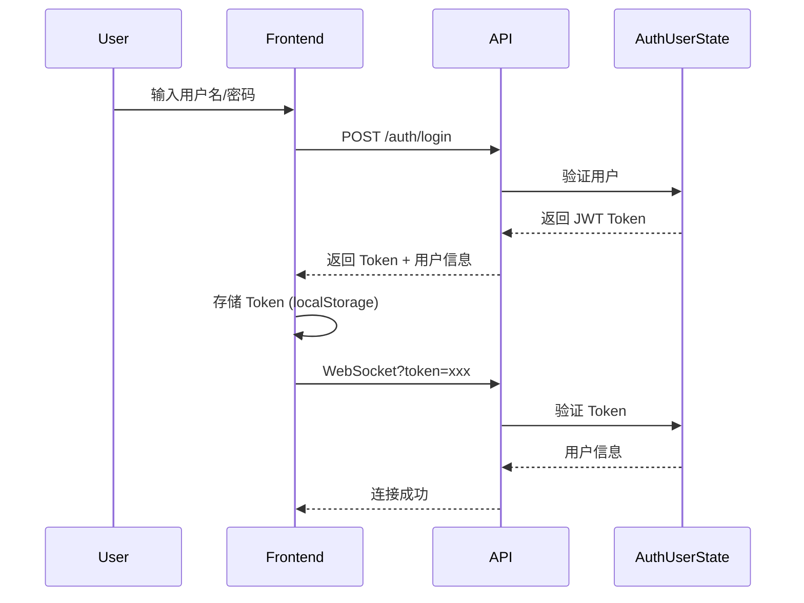
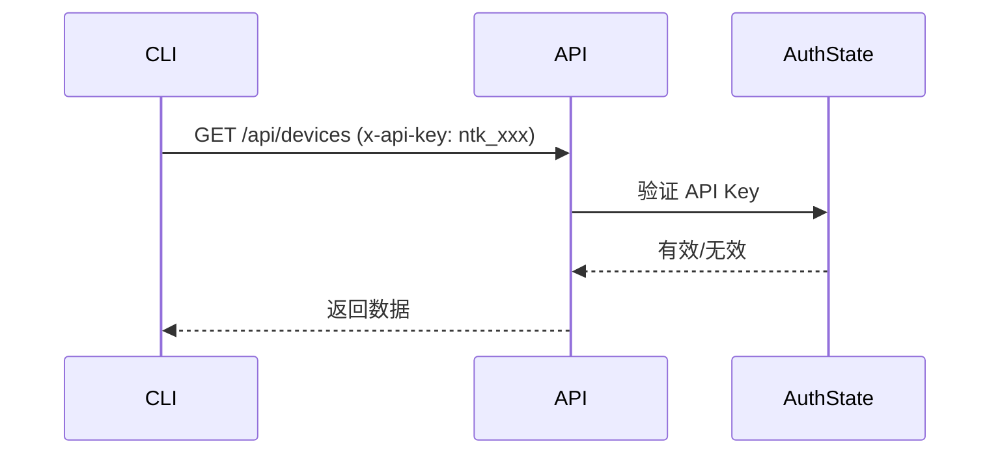

# 认证系统改进方案

## 问题分析

### 当前 API Key 认证的问题

| 问题 | 描述 | 影响 |
|------|------|------|
| **API Key 适合机器调用** | 对于 Web UI 用户来说，API Key 不友好 | 用户体验差 |
| **无用户概念** | 无法区分不同用户的操作 | 无法实现多租户 |
| **权限管理缺失** | 所有关持相同权限 | 安全性低 |
| **无会话管理** | 无法追踪用户登录状态 | 无法实现登出、会话过期 |
| **Key 存储在 localStorage** | 不安全，多设备管理困难 | 安全风险 |

### 为什么 WebSocket 需要 API Key？

当前 WebSocket 聊天处理器要求 API Key，这是合理的，因为：
1. WebSocket 不支持自定义 HTTP 头
2. 需要在建立连接时验证身份
3. 但对于 Web UI 用户，应该使用 JWT Token 替代

## 改进方案：混合认证系统

### 架构设计

```
                    ┌─────────────────────────┐
                    │      NeoTalk Auth       │
                    └─────────────────────────┘
                                     │
                ┌────────────────────┴────────────────────┐
                │                                         │
        ┌───────▼───────┐                       ┌───────▼───────┐
        │  Web UI 认证  │                       │   API 认证     │
        │  (JWT Token)  │                       │  (API Key)    │
        └───────────────┘                       └───────────────┘
                │                                         │
        ┌───────▼───────┐                       ┌───────▼───────┐
        │ 用户名/密码   │                       │ API Key       │
        │ JWT Session   │                       │ Bearer Token  │
        │ WebSocket     │                       │ CLI 工具      │
        │ 自动续期       │                       │ 长期有效       │
        └───────────────┘                       └───────────────┘
```

### 认证流程对比

#### Web UI 用户登录流程



#### API 调用流程



## 实现路线图

### Phase 1: 核心用户认证 (已完成)

- [x] `AuthUserState` - 用户管理状态
- [x] `User` 结构 - 用户数据模型
- [x] `UserRole` - 角色枚举 (Admin/User/Viewer)
- [x] `SessionInfo` - 会话信息
- [x] JWT Token 生成/验证
- [x] 密码哈希 (SHA-256，后续升级为 bcrypt)
- [x] 默认管理员账户创建

**位置**: `/Users/shenmingming/NeoTalk/crates/api/src/auth_users.rs`

### Phase 2: API 处理器 (待实现)

需要添加以下 API 端点：

| 端点 | 方法 | 描述 | 认证 |
|------|------|------|------|
| `/auth/login` | POST | 用户登录 | 无 |
| `/auth/register` | POST | 用户注册 | Admin |
| `/auth/logout` | POST | 用户登出 | JWT |
| `/auth/me` | GET | 获取当前用户信息 | JWT |
| `/auth/change-password` | POST | 修改密码 | JWT |
| `/users` | GET | 列出所有用户 | Admin |
| `/users/:id` | DELETE | 删除用户 | Admin |

### Phase 3: WebSocket 认证改造 (待实现)

修改 WebSocket 聊天处理器以支持 JWT：

```rust
// 当前：只接受 API Key
ws://host/api/chat?api_key=xxx

// 改进后：接受 JWT Token 或 API Key
ws://host/api/chat?token=eyJhbGc...  // JWT 用户
ws://host/api/chat?api_key=ntk_xxx  // API 调用
```

### Phase 4: 前端改造 (待实现)

1. **登录页面** (`/login`)
   - 用户名/密码表单
   - 记住我功能
   - 错误提示

2. **认证上下文**
   ```typescript
   interface AuthContext {
     user: User | null
     token: string | null
     login: (username: string, password: string) => Promise<void>
     logout: () => void
     isAuthenticated: boolean
   }
   ```

3. **WebSocket 改造**
   ```typescript
   // 使用 JWT Token 连接
   wsUrl += `?token=${token}`
   ```

### Phase 5: 权限集成 (待实现)

将用户角色集成到现有功能：

| 功能 | Viewer | User | Admin |
|------|--------|------|-------|
| 查看设备 | ✅ | ✅ | ✅ |
| 聊天 | ✅ | ✅ | ✅ |
| 修改配置 | ❌ | ✅ | ✅ |
| 管理用户 | ❌ | ❌ | ✅ |
| 删除数据 | ❌ | ❌ | ✅ |

## 配置

### 环境变量

```bash
# JWT 密钥 (生产环境必须设置)
export NEOTALK_JWT_SECRET="your-secret-key-min-32-chars"

# API Key (可选，用于 CLI 工具)
export NEOTALK_API_KEY="ntk_your-api-key"
```

### 默认账户

首次启动时自动创建：

| 用户名 | 密码 | 角色 | 说明 |
|--------|------|------|------|
| admin | admin123 | Admin | 默认管理员，请立即修改密码 |

## 迁移计划

### 向后兼容

1. **API Key 认证保持不变**
   - CLI 工具继续使用 API Key
   - 现有集成不受影响

2. **WebSocket 双模式支持**
   ```rust
   // 伪代码
   if let Some(token) = params.get("token") {
       // JWT 认证 (Web UI)
       validate_jwt(token)
   } else if let Some(api_key) = params.get("api_key") {
       // API Key 认证 (CLI)
       validate_api_key(api_key)
   } else {
       // 开发模式允许无认证
       #[cfg(debug_assertions)]
       allow_connection()
   }
   ```

### 数据迁移

不需要迁移 - 新用户系统独立存储在 `data/users.redb`

## 安全建议

1. **密码哈希升级**
   - 当前: SHA-256
   - 建议: bcrypt 或 argon2

2. **JWT 密钥**
   - 必须通过环境变量设置
   - 至少 32 字符
   - 定期轮换

3. **Token 有效期**
   - 当前: 7 天
   - 建议: 短期 Token + 刷新 Token 机制

4. **HTTPS**
   - 生产环境必须使用 HTTPS
   - WebSocket 使用 WSS

## 下一步

1. 实现 API 处理器 (`handlers/auth_users.rs`)
2. 更新 WebSocket 认证逻辑
3. 实现前端登录页面
4. 添加用户管理 UI
5. 集成权限控制到现有端点
