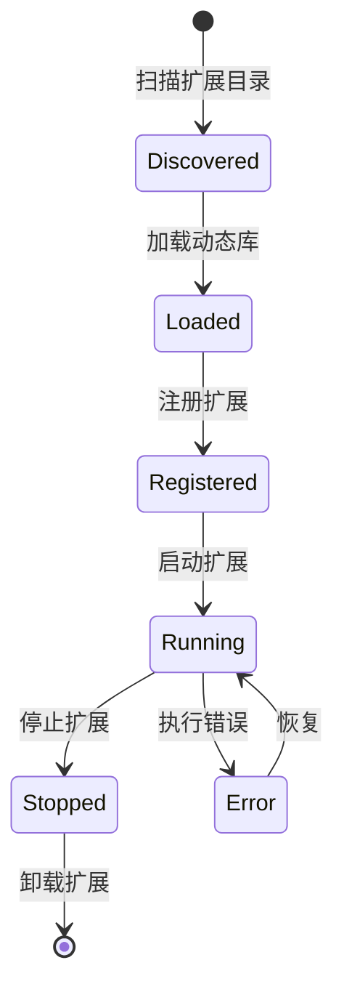

# Extension SDK 模块

**包名**: `neomind-extension-sdk`
**版本**: 0.5.8
**完成度**: 85%
**用途**: 动态扩展开发SDK

## ⚠️ 重要变更 (v0.5.x)

**Extension系统 (V2) 已统一**。本SDK支持两种扩展开发模式：

1. **V2 Extension** - 推荐，使用设备标准类型
2. **Legacy Plugin** - 向后兼容

详见 [Extension迁移文档](../../architecture/plugin-migration.md)。

## 概述

Extension SDK 提供了开发 NeoMind 动态扩展所需的宏、类型和工具。

## 模块结构

```
crates/neomind-extension-sdk/src/
├── lib.rs                      # 公开接口
├── macros.rs                   # 过程宏
├── descriptor.rs               # 插件描述符（Legacy）
├── types.rs                    # 扩展类型定义
└── error.rs                    # 错误类型
```

## V2 Extension 系统

### 核心 Trait

```rust
/// Extension trait - 所有扩展必须实现
pub trait Extension: Send + Sync {
    /// 获取扩展元数据
    fn metadata(&self) -> &ExtensionMetadata;

    /// 获取扩展提供的指标定义
    fn metrics(&self) -> &[MetricDefinition] {
        &[]
    }

    /// 获取扩展提供的命令定义
    fn commands(&self) -> &[ExtensionCommand] {
        &[]
    }

    /// 执行命令
    fn execute_command(&self, command: &str, _args: &Value) -> Result<Value, ExtensionError> {
        Err(ExtensionError::UnsupportedCommand {
            command: command.to_string(),
        })
    }

    /// 健康检查
    fn health_check(&self) -> Result<bool, ExtensionError> {
        Ok(true)
    }
}
```

### ExtensionMetadata

```rust
pub struct ExtensionMetadata {
    /// 扩展ID (例如 "com.example.my_extension")
    pub id: String,
    /// 扩展名称
    pub name: String,
    /// 扩展版本
    pub version: String,
    /// 扩展描述
    pub description: Option<String>,
    /// 作者
    pub author: Option<String>,
    /// 主页URL
    pub homepage: Option<String>,
    /// 许可证
    pub license: Option<String>,
    /// 文件路径（加载后设置）
    #[serde(skip)]
    pub file_path: Option<std::path::PathBuf>,
}
```

### MetricDefinition - 指标定义

```rust
pub struct MetricDefinition {
    /// 指标名称
    pub name: String,
    /// 显示名称
    pub display_name: String,
    /// 数据类型
    pub data_type: MetricDataType,
    /// 测量单位
    pub unit: String,
    /// 最小值
    pub min: Option<f64>,
    /// 最大值
    pub max: Option<f64>,
    /// 是否必需
    pub required: bool,
}

pub enum MetricDataType {
    Float,
    Integer,
    Boolean,
    String,
    Binary,
    Enum { options: Vec<String> },
}
```

### ExtensionCommand - 命令定义

```rust
pub struct ExtensionCommand {
    /// 命令名称
    pub name: String,
    /// 显示名称
    pub display_name: String,
    /// 负载模板
    pub payload_template: String,
    /// 命令参数
    pub parameters: Vec<ParameterDefinition>,
    /// 固定值
    pub fixed_values: serde_json::Map<String, Value>,
    /// AI提示
    pub llm_hints: String,
    /// 参数组
    pub parameter_groups: Vec<ParameterGroup>,
}

pub struct ParameterDefinition {
    pub name: String,
    pub display_name: String,
    pub description: String,
    pub param_type: MetricDataType,
    pub required: bool,
    pub default_value: Option<Value>,
    pub min: Option<f64>,
    pub max: Option<f64>,
    pub options: Vec<String>,
}
```

## 宏系统

### declare_extension! - 声明扩展

```rust
declare_extension!(
    MyExtension,
    metadata: ExtensionMetadata {
        name: "my.extension".to_string(),
        version: "1.0.0".to_string(),
        author: "Your Name".to_string(),
        description: "My extension".to_string(),
    },
);
```

### export_plugin! - 导出扩展（Legacy）

```rust
export_plugin!(
    MyPlugin,
    "my-plugin",
    "1.0.0",
    PluginType::Tool,
    name: "My Tool",
    description: "A sample plugin"
);
```

生成的符号：
- `neomind_extension_descriptor` / `neomind_plugin_descriptor` - 扩展描述符
- `neomind_extension_create` / `neomind_plugin_create` - 创建实例
- `neomind_extension_destroy` / `neomind_plugin_destroy` - 销毁实例

## ABI 版本

```rust
/// 当前扩展 ABI 版本
pub const NEO_EXT_ABI_VERSION: u32 = 2;

/// 向后兼容别名
pub const PLUGIN_ABI_VERSION: u32 = NEO_EXT_ABI_VERSION;
```

## 扩展生命周期



## 扩展类型

| 类型 | 说明 | 示例 |
|------|------|------|
| `DeviceAdapter` | 设备协议适配器 | Modbus, LoRaWAN |
| `DataSource` | 数据源提供者 | Weather API, Stock API |
| `AlertChannel` | 告警通道 | 钉钉, 企业微信, Email |
| `Tool` | AI工具 | 自定义分析工具 |
| `LlmBackend` | LLM后端 | 自定义LLM提供者 |
| `Generic` | 通用扩展 | 自定义功能 |

## API 端点

```
# Extensions (V2)
GET    /api/extensions                     # 列出扩展
POST   /api/extensions                     # 注册扩展
GET    /api/extensions/:id                 # 获取扩展
DELETE /api/extensions/:id                 # 删除扩展
POST   /api/extensions/:id/start           # 启动扩展
POST   /api/extensions/:id/stop            # 停止扩展
GET    /api/extensions/:id/health          # 健康检查
POST   /api/extensions/:id/command         # 执行命令
GET    /api/extensions/:id/stats           # 获取统计
POST   /api/extensions/discover            # 发现扩展
GET    /api/extensions/types               # 扩展类型

# 扩展指标
GET    /api/extensions/:id/metrics         # 列出扩展指标
POST   /api/extensions/:id/metrics         # 注册指标
DELETE /api/extensions/:id/metrics/:name   # 删除指标
```

## 开发示例

### 最小扩展（V2）

```rust
use neomind_extension_sdk::prelude::*;

struct MyExtension;

// 声明扩展
declare_extension!(
    MyExtension,
    metadata: ExtensionMetadata {
        name: "hello.extension".to_string(),
        version: "1.0.0".to_string(),
        author: "Your Name".to_string(),
        description: "A simple hello extension".to_string(),
    },
);

// 实现 trait（如果是简单的扩展，可以只实现 metadata）
impl Extension for MyExtension {
    fn metadata(&self) -> &ExtensionMetadata {
        static METADATA: ExtensionMetadata = ExtensionMetadata {
            id: "hello.extension".to_string(),
            name: "Hello Extension".to_string(),
            version: "1.0.0".to_string(),
            description: Some("A simple hello extension".to_string()),
            author: Some("Your Name".to_string()),
            homepage: None,
            license: None,
            file_path: None,
        };
        &METADATA
    }
}
```

### 数据源扩展（V2）

```rust
use neomind_extension_sdk::prelude::*;
use serde_json::json;

struct WeatherExtension;

// 指标定义
const METRICS: &[MetricDefinition] = &[
    MetricDefinition {
        name: "temperature".to_string(),
        display_name: "Temperature".to_string(),
        data_type: MetricDataType::Float,
        unit: "°C".to_string(),
        min: Some(-50.0),
        max: Some(50.0),
        required: true,
    },
    MetricDefinition {
        name: "humidity".to_string(),
        display_name: "Humidity".to_string(),
        data_type: MetricDataType::Integer,
        unit: "%".to_string(),
        min: Some(0.0),
        max: Some(100.0),
        required: true,
    },
];

impl Extension for WeatherExtension {
    fn metadata(&self) -> &ExtensionMetadata {
        // ... 返回元数据
    }

    fn metrics(&self) -> &[MetricDefinition] {
        METRICS
    }

    fn execute_command(&self, command: &str, args: &Value) -> Result<Value, ExtensionError> {
        match command {
            "refresh" => {
                // 刷新天气数据
                Ok(json!({"status": "refreshed"}))
            }
            _ => Err(ExtensionError::CommandNotFound(command.to_string())),
        }
    }
}
```

### 工具扩展（V2）

```rust
use neomind_extension_sdk::prelude::*;

struct CalculatorExtension;

const CALCULATOR_TOOLS: &[ExtensionCommand] = &[
    ExtensionCommand {
        name: "add".to_string(),
        display_name: "Add".to_string(),
        payload_template: "{ \"a\": {{a}}, \"b\": {{b}} }".to_string(),
        parameters: vec![
            ParameterDefinition {
                name: "a".to_string(),
                display_name: "First Number".to_string(),
                description: "First number to add".to_string(),
                param_type: MetricDataType::Float,
                required: true,
                default_value: None,
                min: None,
                max: None,
                options: vec![],
            },
            // ... 其他参数
        ],
        fixed_values: serde_json::Map::new(),
        llm_hints: "Adds two numbers together".to_string(),
        parameter_groups: vec![],
    },
    // ... 其他工具
];

impl Extension for CalculatorExtension {
    fn commands(&self) -> &[ExtensionCommand] {
        CALCULATOR_TOOLS
    }

    fn execute_command(&self, command: &str, args: &Value) -> Result<Value, ExtensionError> {
        match command {
            "add" => {
                let a = args["a"].as_f64().unwrap_or(0.0);
                let b = args["b"].as_f64().unwrap_or(0.0);
                Ok(serde_json::json!({ "result": a + b }))
            }
            _ => Err(ExtensionError::CommandNotFound(command.to_string())),
        }
    }
}
```

## Legacy Plugin 开发

### 使用旧式 Plugin trait

```rust
use neomind_extension_sdk::prelude::*;

struct MyPlugin;

export_plugin!(
    MyPlugin,
    "hello",
    "1.0.0",
    PluginType::Tool,
    name: "Hello Tool",
    description: "A simple tool"
);

#[plugin_impl]
impl MyPlugin {
    fn new(config: &Value) -> PluginResult<Self> {
        Ok(MyPlugin {
            config: config.clone(),
        })
    }

    fn handle(&mut self, request: PluginRequest) -> PluginResult<PluginResponse> {
        match request.command.as_str() {
            Some("hello") => Ok(PluginResponse::success(json!({"message": "Hello!"}))),
            _ => Ok(PluginResponse::error("Unknown command")),
        }
    }
}
```

## 当前状态

| 功能 | 状态 | 说明 |
|------|------|------|
| Extension trait (V2) | ✅ | 完整实现 |
| 宏定义 | ✅ | declare_extension、export_plugin等 |
| 类型定义 | ✅ | 完整的类型系统 |
| FFI 接口 | ✅ | C ABI 兼容 |
| Native 加载器 | ✅ | .so/.dylib/.dll 支持 |
| WASM 加载器 | 🟡 | 框架存在，执行环境待完善 |

## 设计原则

1. **ABI 稳定**: FFI 接口向后兼容
2. **类型安全**: Rust 类型与 FFI 类型分离
3. **宏简化**: 使用宏隐藏 FFI 复杂性
4. **沙箱隔离**: 支持 WASM 沙箱执行
5. **设备标准**: V2 使用与设备相同的类型系统
